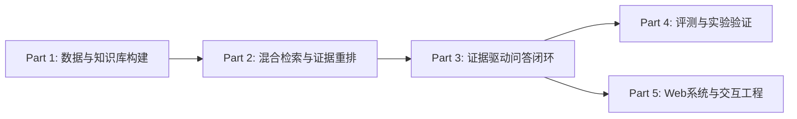

# FORAG 项目技术总结 (Final Project Summary)

---

## 1. 项目介绍版本库 (Project Introductions)

### A. 项目标准介绍（约 150 字）
面向户外功能服装养护知识分散、用户口语表达与品牌专业资料难以直接匹配的问题，构建支持证据溯源的 RAG 智能问答系统。将 14 个官方权威来源的护理文档经结构感知切分、元数据标注与 E5 向量化后写入 Elasticsearch；采用 BM25 与 Dense 双路召回，经 RRF 融合与 Cross-Encoder 重排精选 Top-5 证据；基于 LangGraph 编排查询分析、证据判定、Query Rewrite 与生成闭环，并通过 FastAPI 与 Vue3 实现 Web 交互。冻结正式 TEST 的 Recall@5 为 87.5%，Claim Recall 和 Faithfulness 分别为 77.9% 和 81.4%。

### B. 简历项目简介（约 100~150 字）
基于 LangGraph 与混合检索构建垂直领域户外服装养护 RAG 问答系统。针对口语提问与专业资料的语义断层，设计 BM25 + Dense 双路召回、RRF 融合与 Cross-Encoder 重排的完整检索链路；通过 LangGraph 编排多节点证据判定与安全拒绝机制，确保回答行行有据。在 16 条冻结正式 TEST 样本上实现 Recall@5 87.5%，RAGChecker 事实覆盖率 77.9%、事实忠实度 81.4%。

### C. 答辩口头介绍（约 200~300 字）
各位老师好！我汇报的项目是面向户外功能服装智能养护的可追溯 RAG 问答系统 FORAG。当前大模型在处理专业面料洗烘时容易出现幻觉甚至误导，导致昂贵衣物受损。本项目核心不是做一个普通聊天机器人，而是构建一个「可检索、可判断、可追溯、可评估」的证据驱动问答闭环。
我主要负责系统的核心混合检索与证据重排模块。针对用户口语与官方规范术语差异，我们在 Elasticsearch 上构建了包含 14 个官方来源、234 个规范切片的专业知识库，采用 BM25 与 Dense 向量双路并行召回，通过 RRF 解决异构排名融合问题，并利用 Cross-Encoder 进行深度重排。在 16 条冻结正式 TEST 样本评测中，系统最终 Top-5 证据召回率达到 87.5%，RAGChecker 事实忠实度为 81.4%。

---

## 2. 问题定义与核心价值

- **行业痛点**：户外功能服装（如 GORE-TEX 防水膜、DWR 防泼水涂层、高端白鹅绒）养护规则复杂且严苛，普通洗衣液或高温烘干极易造成面料损毁。互联网资料碎片化、偏方泛滥，而品牌官方指南分布分散。
- **通用大模型缺陷**：直接使用通用大模型易发生无依据推测、参数幻觉，无法提供确定性的行内出处溯源。
- **项目核心价值**：将户外服装养护问答从「大模型直接凭空生成」转变为「**可检索、可判断、可追溯、可评估**」的证据驱动闭环系统。

---

## 3. 五部分系统总体架构 (Five-Part Structure)

系统整体划分为清晰的五大工程模块：



### Part 1: 数据与专业知识库构建
- **官方数据采集**：从 Arc'teryx、GORE-TEX、Patagonia、Nikwax、Grangers 等 **14 个官方来源**采集权威清洗、烘干、DWR 修复文档。
- **结构感知切分 (Structure-aware Chunking)**：递归解析 Markdown 标题层级与列表块，构建 **234 个精细知识切片**。
- **元数据与向量化**：每条切片赋予唯一稳定 ID、规范化术语标签与 `passage: ` 前缀，通过 `intfloat/multilingual-e5-small` 生成 384 维稠密向量。
- **Elasticsearch 索引**：在 Elasticsearch 9.5.1 中建立支持 BM25 文本倒排索引与 HNSW Dense 向量索引的统一知识库（`fashion_care_kb_v1`）。

### Part 2: 混合检索与证据重排 (本人主要负责)
- **双路并行召回**：
  - **BM25 文本召回**：针对关键词、品牌与专用术语检索 Top-20。
  - **Dense 语义召回**：使用 `query: ` 前缀对问题向量化，检索语义最接近的 Top-20。
- **RRF 倒数排名融合 (Reciprocal Rank Fusion)**：
  - 采用 RRF 算法（$k=60$）融合 BM25 与 Dense 两路异构排名，避免直接比较不同评分空间中的原始分数，去重并合成 Top-30 候选池。
- **Cross-Encoder 深度重排**：
  - 采用多语言交叉编码器 `cross-encoder/mmarco-mMiniLMv2-L12-H384-v1` 将 Query 与 30 条候选切片联合编码，利用细粒度 Token 交互打分，精选最终 Top-5 证据切片。

### Part 3: 证据驱动的 RAG 问答闭环
- **Query Analysis 意图解析**：提取服装品类、材质/品牌、护理动作，判断问题是否具备足够信息。
- **Evidence Judge 证据判定**：在生成前对 Top-5 证据切片进行充分性评估，分为 `sufficient` 与 `insufficient`。
- **Query Rewrite 增量重检**：若首轮证据不足且存在改写价值，触发一次（最大 1 次）改写增量检索。
- **Answer Generation 答案生成与行内引用**：基于确认充分的证据切片生成建议，强制标注行内引用标牌 `[E1]`、`[E2]`，并自动提取关联的官方出处链接（Sources）。
- **LangGraph 状态机编排**：统一管理路由流转，严格输出三大业务状态之一：`answered`、`needs_more_information`、`insufficient_evidence`。

### Part 4: 评测与实验验证
- **Golden Dataset 构建**：人工构建包含 42 条样本的标准评估集（DEV 26 条，TEST 16 条；检索可评测 40 条，负例 2 条）。
- **RAGChecker 事实级评估**：接入 RAGChecker 0.1.9 自动化评估 Claim Recall、Context Precision 与 Faithfulness。
- **DEV 检索消融实验**：设计 4 种变体横向消融，严谨分析双路互补性与阶段转化。
- **错误归因与耗时基准**：对检索未命中样本做归因分析，并在真实设备上完成延迟测定。

### Part 5: Web 系统与工程化交互
- **FastAPI 后端服务**：提供 `/api/chat`、`/api/health`、`/api/metrics` 接口，支持确定性错误处理与 CORS 白名单。
- **Vue 3 + Vite 前端**：高质感双栏版式，提供问答流、Sources 来源清单、Evidence 候选抽屉、检索过程流程图及评测数据看板。
- **单轮无状态契约**：严格遵循无跨轮记忆的单轮问答设计，避免历史会话对当前检索造成隐式干扰。

---

## 4. 本人负责范围 (User Responsibility)

> **本人主要负责 RAG 混合检索与证据重排模块，实现 BM25 与 Dense Vector 双路召回、RRF 融合及 Cross-Encoder 重排，完成从候选召回到 Top-K 证据筛选的检索流程。**

在整个系统中：
- **核心主导**：Part 2 混合检索架构设计、Elasticsearch 索引结构定义、RRF 融合算法实现、Cross-Encoder 重排优化以及 DEV 检索消融评测。
- **系统参与**：参与 Part 1 知识库清洗规范、Part 3 LangGraph 检索节点接入、Part 4 评测指标对齐与 Part 5 前后端接口联调。

---

## 5. 核心实验与量化评测结果

### 5.1 官方冻结评测指标 (Stage 14 Official TEST)
基于 16 条冻结正式 TEST 样本与 RAGChecker 0.1.9 事实级自动化评测：

| 评测指标 | 官方冻结数值 | 指标客观定义与业务解释 |
| :--- | :---: | :--- |
| **Success@5 / Recall@5** | **87.5%** (14/16) | 14 个样本在最终 Top-5 中精确召回了目标黄金切片。 |
| **Claim Recall** | **77.9%** | 回答覆盖了参考答案中 77.9% 的核心事实声明；复杂多条件场景仍存在事实细节遗漏。 |
| **Context Precision** | **41.2%** | **系统当前主要性能限制**。Top-5 候选窗口中存在较多未直接引用的背景文字。 |
| **Faithfulness** | **81.4%** | 多数生成内容能够得到检索证据支持；通过证据约束与保守路由降低无依据生成风险。 |

### 5.2 DEV 检索模块消融实验 (DEV Retriever Ablation)
在 24 条 DEV 可评测样本上，对检索链路各变体进行了独立消融：

| 检索变体 (Variant) | Top-5 命中数 | Recall@5 | 变体设计与阶段收益说明 |
| :--- | :---: | :---: | :--- |
| **Variant A: BM25 Only** | 4 / 24 | **16.7%** | 仅依赖词频匹配，受专业词与口语表达差异影响大。 |
| **Variant B: Dense Only** | 9 / 24 | **37.5%** | 仅依赖向量语义相关度，语义泛化能力强。 |
| **Variant C: BM25+Dense+RRF Top5** | 9 / 24 | **37.5%** | 完成异构排名融合；构建统一 Top-30 候选池。 |
| **Variant D: Full (RRF + Cross-Encoder)** | 12 / 24 | **50.0%** | Cross-Encoder 深度交互打分，实现 **+3 hits 净收益**。 |

#### 关键消融发现与严谨解释：
1. **BM25 与 Dense 互补性**：
   - 统计矩阵：`both_hit = 2`, `bm25_only_hit = 2`, `dense_only_hit = 7`, `neither_hit = 13`（总计 24 条）。
   - 两路检索存在真实互补，在当前 DEV 样本中 Dense 独占命中更多。
2. **Dense 与 BM25 的对比**：
   - 在当前 24 条 DEV 样本上，Dense-only Recall@5（37.5%）数值高于 BM25-only（16.7%）。该结果反映当前样本观测差异，不作无统计检验的泛化断言。
3. **RRF 的核心价值**：
   - 在 Top-5 口径下，RRF 使 1 条样本 rescue、3 条样本 drop，最终 Recall@5 仍为 37.5%。
   - RRF 的主要作用不是在 Top-5 上直接提分，而是**统一异构分数空间**，构造高质量的 Top-30 候选池，供后续重排模型精选。
4. **Cross-Encoder 重排收益**：
   - 相较 RRF Top-5，Cross-Encoder 救回 7 条（miss $\rightarrow$ hit），丢弃 4 条（hit $\rightarrow$ miss），净增加 3 条命中，Recall@5 由 37.5% 提升至 50.0%。

---

## 6. 检索错误归因分析 (Failure Analysis)

在 DEV 检索评估中，最终共有 12 条样本未能在 Top-5 中召回黄金切片。归因分析如下：

```text
未命中样本总数 (12 条)
├── 候选召回损失 (Candidate-Generation Loss): 5 条 (41.7%)
│   └── 正确证据在前置 BM25 与 Dense 双路召回中均未进入 Top-20。
├── 融合排序损失 (Fusion/Ranking Loss): 0 条 (0.0%)
│   └── 召回命中切片均成功保留在 RRF Top-30 候选池中。
└── 重排损失 (Rerank Loss): 7 条 (58.3%)
    └── 正确证据位于 RRF Top-30 候选池中，但 Cross-Encoder 打分后未能排进最终 Top-5。
```

- **分析结论**：错误由「前置召回缺失（5条）」与「重排截断（7条）」共同造成。这证明未来的优化应同时聚焦于前置召回词扩展与重排交互特征增强。

---

## 7. 本机端到端延迟测试 (Local Latency Smoke Benchmark)

- **测试环境**：Windows 10, Intel Core i7-8750H, 16GB RAM, Python 3.12, ES 9.5.1 (本地), 模型运行于 CPU / 远端 API。
- **性质说明**：**本机小样本延迟探测（Small-sample local latency smoke, $n=3$），非生产环境基准，结果受网络与 CPU 负载影响。**

| 阶段 / 耗时指标 | 最小值 (Min) | 均值 (Mean) | 最大值 (Max) | 样本数 / 统计口径说明 |
| :--- | :---: | :---: | :---: | :--- |
| **端到端总耗时 (E2E Latency)** | 5798 ms | **9712.7 ms** | 12833 ms | $n=3$（全量测试样本） |
| **意图解析阶段 (Query Analysis)** | 2638 ms | **2931.0 ms** | 3091 ms | $n=3$（大模型 API 调用） |
| **混合检索阶段 (Hybrid Retrieval)** | 1649 ms | **1681.3 ms** | 1703 ms | $n=3$（BM25+Dense+RRF+CE CPU 推理） |
| **证据判定阶段 (Evidence Judge)** | 1429 ms | **1469.7 ms** | 1508 ms | $n=3$（大模型 API 调用） |
| **回答生成阶段 (Answer Generation)** | 4309 ms | **5441.5 ms** | 6574 ms | **$n=2$（仅统计进入回答生成的样本）** |
| **终止响应处理 (Terminal Response)** | < 1 ms | < 1 ms | < 1 ms | $n=1$（未调用生成模型，直接模板输出） |

---

## 8. 当前系统局限性 (Limitations)

1. **上下文纯度较低 (Context Precision = 41.2%)**：Top-5 候选切片中包含较多未被引用的背景上下文，增加了模型输入长度与潜在干扰。
2. **证据判定保守性**：在部分临界样本上，Evidence Judge 倾向于安全退出并引导用户补充信息，存在一定的保守路由倾向。
3. **单轮无状态交互**：不支持跨轮代词追问与会话记忆。

---

## 9. 未来优化方向 (Future Work)

- **动态 Top-K 与细粒度段落过滤**：引入自适应重排阈值，基于语义相关度动态截断，提升上下文纯度。
- **知识库扩充与切片重叠优化**：针对事实覆盖缺口扩展权威品牌养护指南，精细调整切片边界。
- **多轮会话记忆接入**：设计带上下文显式消歧的会话状态管理机制，支持代词追问与连续养护咨询。
